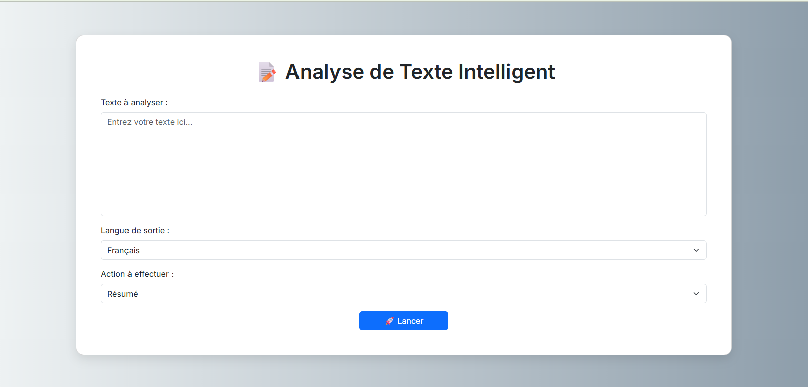

# 🧠 Analyse de Texte Intelligente avec Flask, NVIDIA API et Docker


## 1. Introduction Générale

Ce projet est une application web full-stack, conteneurisée et prête pour le déploiement. Elle offre une interface utilisateur simple et intuitive pour réaliser des opérations complexes de traitement du langage naturel (NLP). En s'appuyant sur la puissance du grand modèle de langage **Llama 3 de Meta**, hébergé sur l'infrastructure de **NVIDIA**, l'application peut comprendre, analyser, transformer et générer du texte en plusieurs langues.

L'objectif principal est de fournir un outil accessible qui démontre une architecture logicielle moderne, modulaire et scalable, en utilisant des technologies de pointe comme Flask pour le backend, Docker pour la conteneurisation, et une API externe pour l'intelligence artificielle.

---

## 2. Fonctionnalités Clés

- 🌍 **Support Multilingue Robuste** : L'application gère nativement les entrées et les sorties en Anglais (`en`), Français (`fr`), et Arabe (`ar`).
- 🧩 **Interface Centralisée Multi-Tâches** : Une seule interface utilisateur permet d'accéder à plus de 10 fonctionnalités distinctes, allant du résumé à la génération de code.
- 🚀 **Performance et Intelligence Artificielle de Pointe** : Utilise le modèle `meta/llama-3.1-70b-instruct`, une intelligence artificielle de 70 milliards de paramètres, garantissant des réponses de haute qualité.
- 🐳 **Portabilité et Reproductibilité Absolues avec Docker** : L'application est entièrement conteneurisée. Cela garantit une installation et une exécution sans friction sur n'importe quelle machine où Docker est installé, éliminant les problèmes de compatibilité.
- 🏗️ **Architecture Modulaire et Maintenable** : Le code est rigoureusement séparé en couches logiques (présentation, service), ce qui le rend facile à comprendre, à maintenir et à faire évoluer.

---

## 3. 📸 Captures d'écran

### Interface Utilisateur de l'Application
<p align="center">
  
</p>
<p align="center">
  <b>[Placez ici votre capture d'écran de l'interface web en fonctionnement]</b>
</p>

### Image Docker (`docker images`)
<!-- 
    INSTRUCTIONS : Remplacez la ligne ci-dessous par votre capture d'écran.
    Exemple :  
-->
<p align="center">
  <b>[Placez ici votre capture d'écran de la sortie de la commande `docker images` montrant l'image `text-analyzer-app`]</b>
</p>

### Conteneur en Cours d'Exécution (`docker ps`)
<!-- 
    INSTRUCTIONS : Remplacez la ligne ci-dessous par votre capture d'écran.
    Exemple :  
-->
<p align="center">
  <b>[Placez ici votre capture d'écran de la sortie de la commande `docker ps` montrant le conteneur `my-text-app` actif]</b>
</p>

---

## 4. Architecture Détaillée du Projet

Pour comprendre le fonctionnement de l'application, il faut visualiser le trajet d'une requête de l'utilisateur jusqu'à la réponse de l'IA.

**Diagramme de Flux :**
`Utilisateur` -> `Navigateur Web` -> `Requête HTTP POST` -> `Conteneur Docker` -> `Flask (app.py)` -> `Appel de fonction` -> `Service (services.py)` -> `Requête API HTTPS` -> `API NVIDIA` -> `Réponse IA` -> `Service (services.py)` -> `Flask (app.py)` -> `Réponse HTML` -> `Navigateur Web` -> `Affichage du résultat`

### 4.1. Analyse des Fichiers du Projet

#### `app.py` - Le Contrôleur / Le Chef d'Orchestre
Ce fichier est le point d'entrée de l'application web. Son rôle n'est pas de traiter le texte, mais de gérer le trafic web en orchestrant les appels entre l'interface utilisateur et la logique métier.

#### `services.py` - La Logique Métier / Le Cerveau
Ce module est le cœur fonctionnel de l'application. Il est volontairement découplé de Flask et de toute logique web. Sa seule et unique tâche est de communiquer avec l'API de NVIDIA pour effectuer le traitement de texte.

##### Fonction `process_text()` Détaillée
C'est l'unique fonction de ce module, mais elle est centrale au projet.

```python
process_text(text: str, lang_choice: str, task: str) -> str
```

Elle traite le texte en utilisant une tâche NLP et une langue cible sélectionnées.

| Paramètre     | Type   | Description                                                     |
|---------------|--------|-----------------------------------------------------------------|
| `text`        | `str`  | Le texte d'entrée à traiter, fourni par l'utilisateur.          |
| `lang_choice` | `str`  | La langue cible pour la réponse : `"en"`, `"fr"`, ou `"ar"`.    |
| `task`        | `str`  | Le nom de la tâche à effectuer (voir la table ci-dessous).      |

**Retourne :**
Une chaîne de caractères (`str`) contenant le résultat traité par l'IA (le résumé, la liste de mots-clés, le sentiment, etc.).

##### Tâches Supportées (`task`)
Voici la liste exhaustive des valeurs possibles pour le paramètre `task`, correspondant aux options de l'interface.

| Nom de la Tâche (`task`) | Description                                                     |
|--------------------------|-----------------------------------------------------------------|
| `translate`              | Traduire le texte dans la langue de sortie choisie             |
| `summary`                | Générer un résumé concis du texte                               |
| `keywords`               | Extraire les thèmes ou mots-clés principaux                     |
| `category`               | Classifier le texte dans une catégorie (santé, politique...)    |
| `simplify`               | Réécrire le texte dans un langage plus simple et accessible     |
| `facts`                  | Extraire les informations factuelles (noms, nombres, dates)     |
| `title`                  | Générer un titre court et informatif pour le texte              |
| `sentiment`              | Déterminer le sentiment (positif, négatif ou neutre)            |
| `question_generation`    | Créer des questions de type quiz avec leurs réponses            |
| `grammar_correction`     | Corriger les fautes de grammaire et d'orthographe               |
| `text_completion`        | Compléter une phrase ou un paragraphe partiel de manière logique|
| `code_generation`        | Générer un extrait de code à partir d'une description en texte  |

#### `templates/index.html` - La Vue / Le Visage de l'Application
Ce fichier définit ce que l'utilisateur voit et avec quoi il interagit, en utilisant HTML, Bootstrap et le moteur de template Jinja2.

#### `requirements.txt` - La Liste des Dépendances
Ce fichier liste les bibliothèques Python externes requises : `Flask` et `openai`.

### 4.2. Le Rôle Central de Docker : L'Environnement Portable

Docker est la technologie qui garantit que notre application fonctionnera de manière identique, peu importe où elle est exécutée, en l'empaquetant dans un **conteneur**.

#### Le `Dockerfile` - La Recette de l'Environnement
Ce fichier est un script qui donne à Docker des instructions, étape par étape, pour construire une **Image** contenant l'application et toutes ses dépendances.

---

## 5. Guide d'Installation et de Lancement

### Prérequis
- [Docker Desktop](https://www.docker.com/products/docker-desktop/) doit être installé et en cours d'exécution.

### Étape 1 : Préparer la Clé API
Créez un fichier nommé `.env` à la racine de votre projet.
```
NVIDIA_API_KEY=VOTRE_CLÉ_API_NVIDIA_ICI
```
*(Remplacez par votre véritable clé)*.

### Étape 2 : Construire l'Image Docker
Ouvrez un terminal dans le dossier du projet et exécutez cette commande.
```bash
docker build -t text-analyzer-app .
```

### Étape 3 : Lancer le Conteneur
Cette commande démarre une instance de votre image.
```bash
docker run -d -p 8080:5000 --name my-text-app --env-file .env text-analyzer-app
```

### Étape 4 : Utiliser l'Application
Ouvrez votre navigateur web à l'adresse suivante : **[http://localhost:8080](http://localhost:8080)**

---

## 6. Référence des Commandes Docker

```bash
# Lister les conteneurs ACTIFS
docker ps

# Lister TOUS les conteneurs (actifs et arrêtés)
docker ps -a

# Arrêter l'application
docker stop my-text-app

# Démarrer un conteneur déjà existant
docker start my-text-app

# Voir les logs en direct (pour le débogage)
docker logs -f my-text-app

# Supprimer un conteneur (doit être arrêté)
docker rm my-text-app

# Supprimer une image (tous les conteneurs l'utilisant doivent être supprimés)
docker rmi text-analyzer-app```
